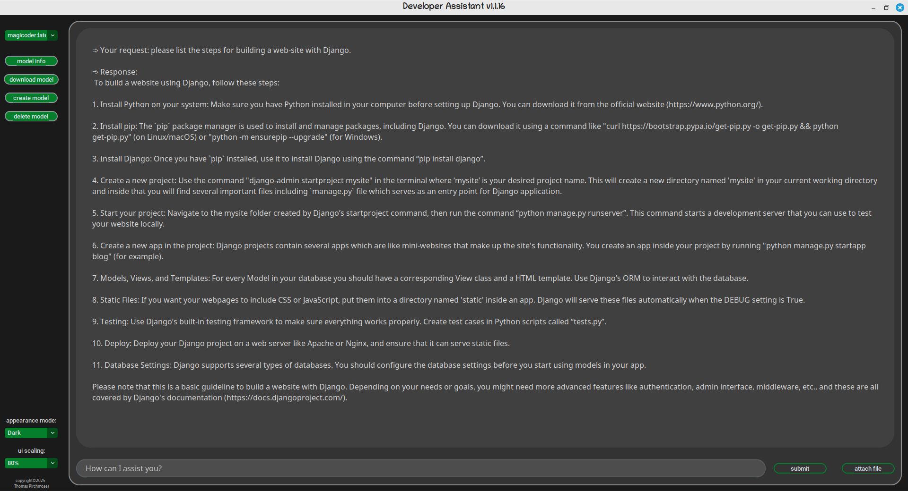

# <ins>***Developer Assistant***</ins>

This application provides a GUI to interact with LLM's (large language models) that are installed locally with Ollama.\
It allows users to submit requests, receive responses, attach files to their requests,
view model info, download, create and delete models.\
The application uses customtkinter for its design and supports
multiple appearance modes and scaling options. 

## ***Installation and setup:***
- Install Ollama for your platform.
  https://ollama.com/download
- Search for a model.
  https://ollama.com/search
- Download a model from the CLI\
  e.g.; ollama pull wizardcoder
- Models can also be downloaded from the app.

> [!TIP]
> In general, larger models will take longer to respond than smaller models.
> Would recommend to download multiple models and try them out.

## ***Usage:***
1. Start by running the script:

         python3 main.py

>[!NOTE]
> Ensure that the ollama server is running.
2. Load a language model by selecting it from the dropdown menu ("Load model").

3. Enter your request in the text entry field. Attach a text file with the "attach file" button to add to the request (optional).
   A text can also be pasted into the text entry field (i.e. a code snippet) from the clipboard by using keyboard shortcuts (ctrl-v for linux).
4. Submit the request using the "submit" button.
5. Receive a response from the LLM, which will be displayed in the reply textbox.

## ***Requirements:***
- python >=3.12.3 
- ollama >=0.6.3
- Install dependencies:

            pip3 install -r requirements.txt

    or

            uv pip3 install -r requirements.txt

    or

            uv add -r requirements.txt

## ***Hardware Requirements:***
- A modern CPU with at least 4 cores.
- GPU acceleration (optional but recommended for larger models).

## ***Features:***
- Load an installed model.
- Download models.
- View info of the loaded model.\
  (details, modelfile, parameter, template, system, adaptor, license)\
- Create your own model based from an existing model.
- Delete models.
- Change GUI appearance.
- Change GUI scaling.
- Stop requests (Linux/Mac).
- Logs are written to the '.dev_assist.log' file on a          rotating basis (max 3 files).

### ***Contributing:***
Contributions are very welcome!\
Please feel free to open an issue or create a pull request if you have any suggestions for improvements or want to contribute new features. 

### ***SUPPORT/CONTACT:***
If you have any questions, need help or want to report a bug, please contact me at tommy_software@mailfence.com.
